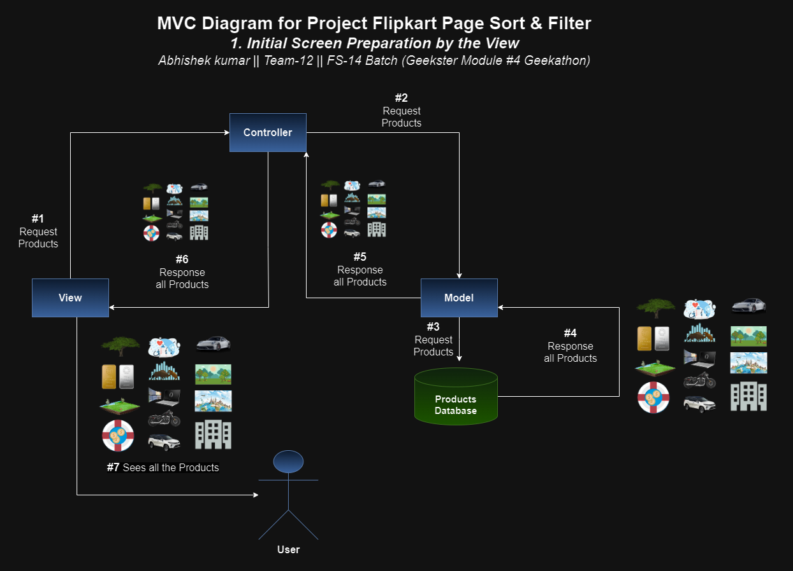

# Project Flipkart Page Sort & Filter || Geekster Module #4 Geekathon


## 1. Objectives
+ Design an User Interface similar to Flipkart page
+ Manipulate JSON data according to the user requests (Search | Sort | Filter)
  + Search products user requested via search box from the JSON Database file
  + Sorting & Filter products as requested by user on the basis of price, popularity available in JSON Database file

## 2. My Learnings
+ Practical use of MVC framework
+ manipulating JSON data using sort, map, filter and forEach methods

## 3. MVC Diagrams


## 4. Hosted Link (Live Preview)
[Project Flipkart Page Sort & Filter](https://alex21c.github.io/prjFlipkartPageSortAndFilter-GeeksterModule4Geekathon/)

## 5. Output Screenshots

## 6. How to set up the development environment on yours local machine
### a. Install Node.js from the link below
[Node.js](https://nodejs.org/en)

### b. Install live server on yours machine 
```bash
npm install live-server -g
```

### c. Install concurrently (allows to run live server along with tailwind css and many more in just one command, as npm start will require it)
```bash
npm install -g concurrently
```

### d. Project Installation (npm will automatically downlaod and install the required dependencies from package.json)
```bash
git clone https://github.com/Alex21c/prjFlipkartPageSortAndFilter-GeeksterModule4Geekathon.git
npm install 
```

### e. Run 
```bash
npm run start
```

## 7. Tech Stack Used
+ [MVC Framework](https://en.wikipedia.org/wiki/Model%E2%80%93view%E2%80%93controller)
+ [Tailwind CSS](https://tailwindcss.com/)
+ [HTML5](https://en.wikipedia.org/wiki/HTML5)
+ [CSS3](https://en.wikipedia.org/wiki/CSS)
+ [JavaScript ES6](https://en.wikipedia.org/wiki/JavaScript)
+ [Font Awesome](https://fontawesome.com/icons)
+ [Google Fonts](https://fonts.google.com/)
+ [Git](https://en.wikipedia.org/wiki/Git)
+ [GitHub](https://github.com/)
+ [VS Code](https://code.visualstudio.com/)


## 8. Author
[Abhishek kumar](https://www.linkedin.com/in/alex21c/), ([Geekster](https://geekster.in/) MERN Stack FS-14 Batch) || Team-12
